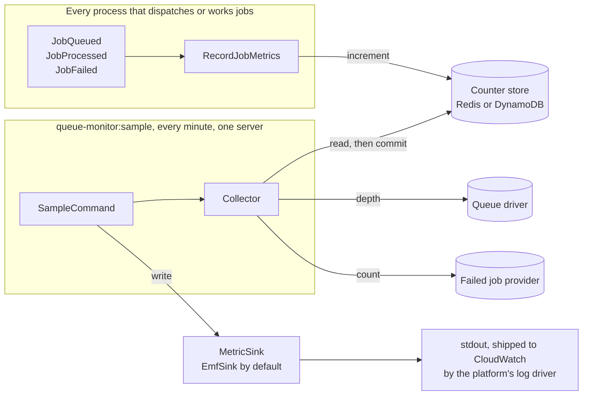
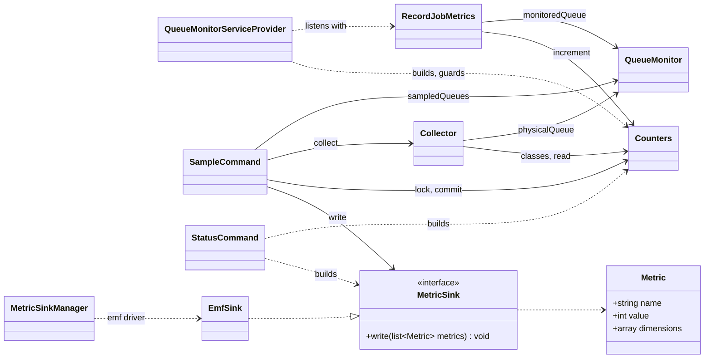

# Developer guide

How the package works inside. Installing and using it is covered in the [README](../README.md).

- [Counting](counting.md): the listener, queue name resolution, the counter store protocol.
- [Sampling](sampling.md): the sampler, the collector, the EMF sink.
- [Development](development.md): running the checks, the tests, invariants, extending.

## Two paths, one store

Every process that dispatches or works jobs counts events into the counter store. Once a minute,
on one server, the sampler reads each queue's depth from its driver, drains the counters and hands
the batch to the sink. The two paths never call each other; the store is all they share.

## Classes

| Class | Responsibility |
|---|---|
| [`QueueMonitorServiceProvider`](../src/QueueMonitorServiceProvider.php) | Singletons, listeners, the counter store guard, commands. |
| [`QueueMonitor`](../src/QueueMonitor.php) | Reads `queue-monitor.*`; maps connections and queue names to the monitored pairs. |
| [`RecordJobMetrics`](../src/RecordJobMetrics.php) | The event listener. Never throws. |
| [`Counters`](../src/Counters.php) | Everything in the counter store: counters, class registry, parking, drain, sampler lock. |
| [`Collector`](../src/Collector.php) | One pair's metrics, and the readings to commit once they are published. |
| [`SampleCommand`](../src/Console/Commands/SampleCommand.php) | Lock, collect, write, commit, pair by pair. |
| [`StatusCommand`](../src/Console/Commands/StatusCommand.php) | Builds every dependency once and prints the setup. |
| [`MetricSinkManager`](../src/MetricSinkManager.php) | Laravel `Manager` of sinks; builds the `emf` driver. |
| [`MetricSink`](../src/MetricSink.php), [`Metric`](../src/Metric.php), [`MetricName`](../src/MetricName.php) | The sink contract, what it receives, the metric names. |
| [`EmfSink`](../src/Sinks/EmfSink.php) | CloudWatch Embedded Metric Format on stdout. |

## Wiring

`register()` merges the config and binds everything as a singleton, so a process holds one
listener, one monitor and one store client.

- `MetricSink` is `MetricSinkManager::sink()`: the driver named by `queue-monitor.sink`.
- `Counters` is built on first use. It takes `counters.store` (else the default store), runs
  `guardCounterStore()`, and wraps the bare store in a `Repository` without an event dispatcher, so
  cache listeners such as Pulse and Telescope never see counter traffic. Its registry holds
  `4 × max_job_classes` names (see [the class registry](counting.md#the-class-registry)).

`boot()` registers the listeners only while `queue-monitor.enabled` is true, so a disabled package
costs nothing on the hot path. The commands and the `queue-monitor-config` publish tag are
registered in the console only.

`guardCounterStore()` accepts DynamoDB, and Redis when its `connection` and `lock_connection` are
both defined under `database.redis` and neither is the connection of a `redis` queue. Counters need
atomic increments and locks shared by every process, which rules out the other stores. Redis bulk
dispatch pushes inside a pipeline and `MULTI` on the queue's connection while `JobQueued` fires, so a
counter command sent on that connection would only be queued and return no count. The guard stands
down under `runningUnitTests()`. `Counters` is resolved inside the listener's guard, so a refused
store is reported instead of thrown into `dispatch()`.

## Vocabulary

| Term | Meaning |
|---|---|
| pair | `[connection, queue]` from `queue-monitor.queues`, after `innerConnection()` |
| window | the events counted for a pair since its last drain |
| registry | the job class names seen on a pair, in first-seen order; the sampler reads only their counters |
| re-check mark | a counter value at which the counter makes sure its class is registered |
| parked | a counter raised past `PARKED` because its class did not fit the registry |
| `__other__` | `Counters::OTHER`, the bucket for classes past the cap |
| reading | the counter values a sample read and subtracts (`commit()`) once they are published |
| fold | moving the readings of classes past `max_job_classes` into `__other__` at sample time |
