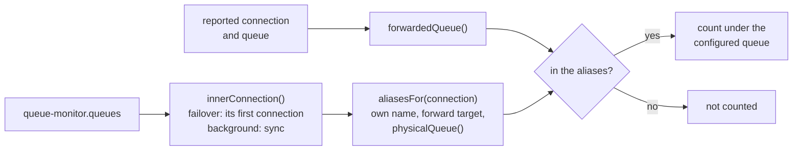
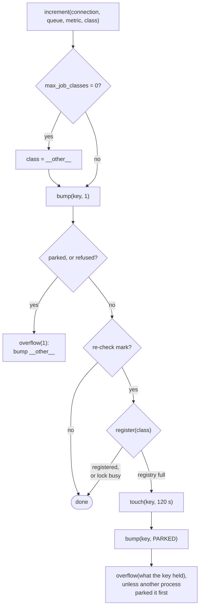
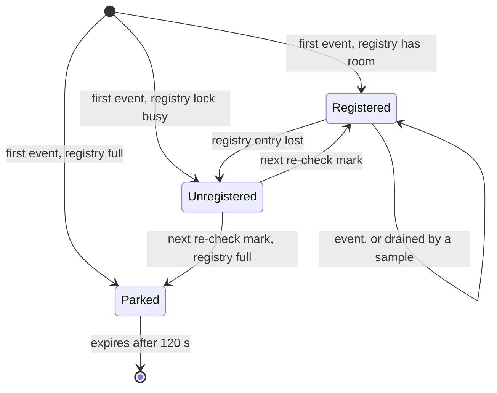

# Counting

Runs inside the application on every job event, so it is built to cost one store round trip and
never to throw.

## The listener

[`RecordJobMetrics`](../src/RecordJobMetrics.php) handles three events:

| Event | Metric | Connection and queue | Class |
|---|---|---|---|
| `JobQueued` | `JobsQueued` | the event's; a missing queue is the connection's default | from the job object: `displayName()`, else its class, or a closure's generated name |
| `JobProcessed` | `JobsCompleted`, unless the job released itself or failed | the job's own, not the worker's: a failover worker reports the failover connection for jobs pushed to the one behind it | the payload's `displayName`, else its `job` |
| `JobFailed` | `JobsFailed` | as above | as above |

`JobQueued` reads the name from the job object instead of decoding the payload. Names are cut to
255 characters, and a missing one is `unknown`.

Every handler runs inside `guard()`. A `Throwable` goes to the exception handler (a handler that
throws too is ignored) and counting stands down for 60 s (`PAUSE`). `Counters` is resolved inside
the guard, so a refused or unreachable store takes the same path. The pause lives on the singleton:
a worker or an Octane process keeps it, a PHP-FPM request loses it.

## Which queue a job counts towards

Drivers do not agree on the name of a queue: SQS workers report its URL, sync-family jobs report
`sync`, and a forwarded queue is reported under its target by database and beanstalkd jobs but
under its source by Redis workers. `record()` asks
[`QueueMonitor::monitoredQueue()`](../src/QueueMonitor.php) for the configured name; `null` means
the queue is not monitored and nothing is written.

`physicalQueue()` is the name the driver resolves a queue to: the SQS URL (also behind Laravel
Cloud's queue), `sync` for the first monitored queue of a sync-family connection, otherwise the
forward target. The alias map is built once per connection and process. A monitored queue's own
name is assigned outright while aliases only fill gaps (`??=`), so it always beats another queue's
alias; and the reported name is forwarded before the lookup, so a job counts under the queue it
landed on when that queue is monitored too.

## The counter store

[`Counters`](../src/Counters.php) owns every key. All of them start with `counters.prefix`; the
store's own prefix still applies in front.

| Key | Value | Expiry |
|---|---|---|
| `{prefix}:v:{h(connection, queue, metric, class)}` | one counter | none; 5 years if seeded by `add()`; 120 s once parked |
| `{prefix}:c:{h(connection, queue)}` | the class registry | never |
| `{prefix}:c:{h(connection, queue)}:lock` | registry lock | 5 s |
| `{prefix}:sample:{h(connection, queue)}` | sampler lock | 300 s |

`h()` is `xxh128` over the parts joined by NUL: keys stay short and printable whatever a job is
called, and names that would collide once joined stay apart.

## increment()

- `bump()` increments. A store that refuses to increment a missing key (DynamoDB answers `false`)
  gets it seeded with `add()`, which `Repository` makes atomic only with a TTL, hence the 5 years;
  if another process seeded it first, it increments again. `null` means the store refused both.
- `crossed()` finds the re-check marks: the counter became 1 (new, or just drained), a power of two
  below 100, or passed a multiple of 100. Only then is the registry read.

## The class registry

The sampler reads only the counters of registered classes, so a counter whose class is missing from
the registry keeps counting but is not published.

- `register()` reads the registry, then takes its lock and reads again before appending, so two
  processes registering at once both survive. A busy lock returns `true`: the count stays under its
  own key and the next mark retries.
- The marks find a class that fell out of the registry (eviction, a flush, a lost write, a busy
  lock) within 100 events, without a registry read on every event.
- The registry holds `4 × max_job_classes` names, so a class past the publish cap still counts under
  its own name and is folded at sample time. `__other__` is always admitted.
- A class that finds the registry full is parked. `touch()` sets the expiry first, so a failure
  afterwards cannot leave the key parked for good; one `bump(key, PARKED)` then moves everything the
  key held, this event and any that raced it, in one atomic step, and that amount goes to
  `__other__`. A result past `2 × PARKED` means another process parked it first and moved those
  events itself. Until the key expires, each event reads as parked and goes straight to `__other__`.

## Draining

- `read()` builds three keys per registered class, fetches them with `many()` in chunks of 100
  (DynamoDB's `BatchGetItem` limit) and keeps values strictly between 0 and `PARKED`, so drained and
  parked keys never read as counts.
- `commit()` decrements each key by exactly what was read, so increments landing between the read
  and the commit survive. A negative result means the key vanished in between; it is incremented
  back by the deficit, since a negative Redis counter would swallow that many future events.

## Cost per event

| Case | Store round trips |
|---|---|
| registered counter, between marks | 1: `INCRBY` |
| at a re-check mark | 2: `INCRBY`, `GET` registry |
| a class's first event, registry has room | 6: `INCRBY`, `GET`, lock, `GET`, `SET`, unlock |
| parked key | 2: `INCRBY`, `INCRBY __other__` |
| first event of a name that does not fit | 5: `INCRBY`, `GET`, `EXPIRE`, `INCRBY PARKED`, `INCRBY __other__` |

`__other__` adds a registry read when it crosses a mark itself. On DynamoDB each round trip is an
HTTPS request, and the first increment of a key adds an `add()`.
[`CountersTest`](../tests/Unit/CountersTest.php) pins the first and fourth rows, and the single
`INCRBY` with `max_job_classes` at `0`, with `SpyStore`.
