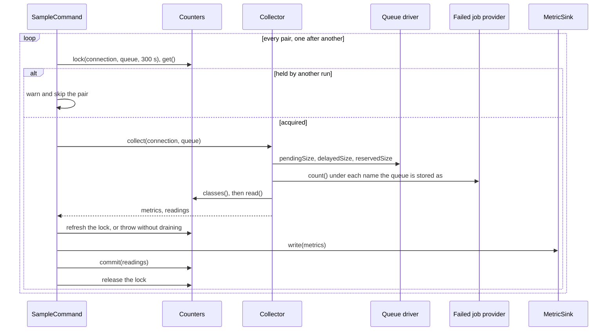
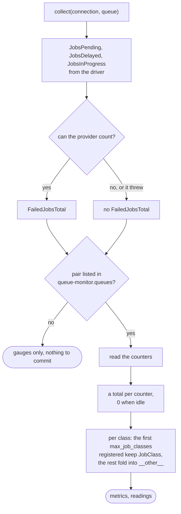
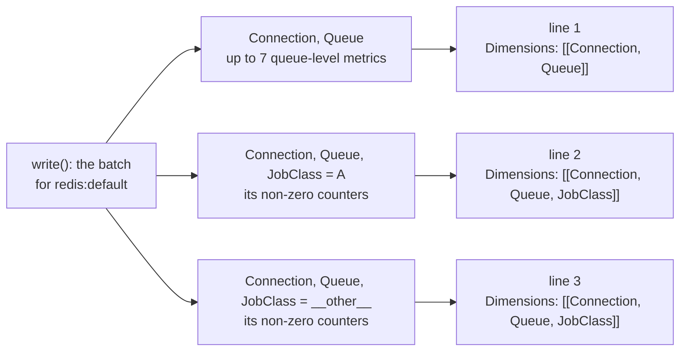

# Sampling

`queue-monitor:sample` runs once a minute on one server. Pair by pair, it reads the gauges and the
counters, publishes one batch, then subtracts what it published.

## The run

- Pairs are `QueueMonitor::sampledQueues()`, or the `queues` argument (`connection:queue`, or a bare
  queue on the default connection) passed through `innerConnection()` like the config.
- The lock lives in the counter store, so two runs never drain the same counters, even from servers
  that do not share the default cache. It lasts 300 s and is refreshed after collecting; a run that
  lost it may be racing a newer one, so it fails the pair rather than drain twice. The write and the
  commit then have 300 s: nothing checks the lock after the refresh. A killed run delays only the
  pair it held.
- The sink returns before anything is subtracted. A sink that throws leaves the counters as they
  were, and the next run publishes them along with its own window: a failure re-publishes, never
  loses.
- A `Throwable` on one pair is reported and printed, the command exits 1, and the loop moves on. A
  store or sink that cannot be built fails the run before the first pair.
- `--dry-run` takes no lock, builds no sink and commits nothing. It prints each metric with its
  dimension values passed through `EmfSink::sanitise()`, as raw output so a job name cannot carry
  console style tags.
- With monitoring disabled the command returns before building anything.

## Collector

- **Failed jobs.** The queue is counted under its configured and its physical name, deduplicated:
  database and beanstalkd failures record the forward target, Redis ones the source name, SQS ones
  the URL, sync ones `sync`. Only `queue:work` stores failed jobs, so a sync-family job that fails in
  a request never reaches this count. A provider that is not a `CountableFailedJobProvider`, is the
  `NullFailedJobProvider`, or serves Laravel Cloud's managed `cloud` connection publishes nothing
  rather than a zero that would keep an alarm green. Cloud wraps the application's provider and
  answers zero for one that cannot count, so the wrapped one, read by reflection, is judged instead.
  A provider that throws is reported and only this metric is dropped.
- **Totals** are published for every counter metric, as `0` when idle, so an alarm on a stalled
  queue has data. `JobsQueued` is left out on sync-family connections, which never fire it.
- **Per class**, readings exist only for non-zero counters, so idle classes publish nothing. The
  kept names are the first `max_job_classes` of the registry, which only ever appends, so the set of
  published series stays fixed from one window to the next. Every other reading, `__other__`'s own
  included, is summed into `__other__`, so the per-class values add up to the total.

## EmfSink

- `group()` keys on the exact dimension map, so each tuple gets one document with one directive and
  one dimension set. CloudWatch publishes every metric of a directive against every dimension set
  in it: a document carrying both the queue-level and the per-class set would publish the queue
  totals once per class.
- A document holds the entity fields, the dimensions, the metric values, and `_aws` last, so neither
  an entity nor a dimension called `_aws` can replace it. `Timestamp` is the write time in
  milliseconds, so each datapoint is stamped at the end of its window.
- Before writing, the output's `fstat()` is compared with the device and inode of `/dev/null`:
  writing there succeeds, and without the check the sampler would drain counters nobody receives.
  Each document is its own `fwrite()`, which a pipe keeps from interleaving with other writers up to
  `PIPE_BUF`; a short write throws.
- `sanitise()` turns a blank value into `__unknown__`; otherwise it transliterates to ASCII, drops
  what is not printable and trims. A value that changed keeps at most 1015 characters plus `#` and
  the `xxh32` of the original, so names that clean to the same text stay apart. Values are capped at
  CloudWatch's 1024; an unchanged one is cut without a hash, which job names, capped at 255 by the
  listener, never need.
- The constructor rejects a namespace CloudWatch would silently drop; `queue-monitor:status`
  surfaces it.

## StatusCommand

Resolves each monitored queue connection, `Counters` (which runs the store guard) and the sink
(which validates the namespace), then prints the sink, the counter store, the `JobClass` setting and
the pairs. Resolving opens no connection. Any failure prints its message and exits 1. It builds
neither the `Collector` nor the failed job provider, so a provider that cannot be built passes the
check and fails every sample.
